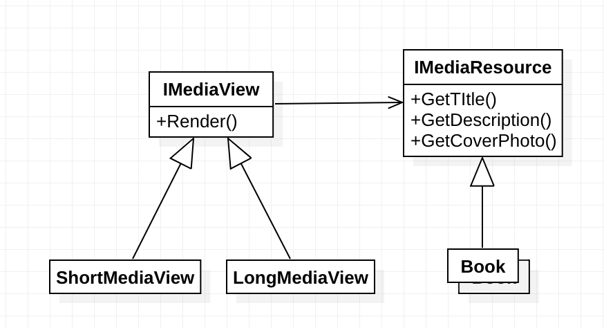
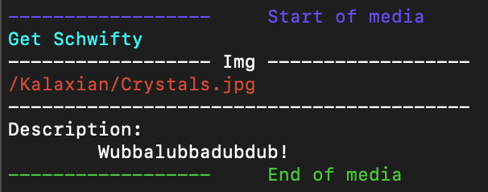

# Lab2 - structural patterns

## Prerequisites:
  * Design patterns
  * Structural design patterns
  * Organize and structure the application using structural design patterns.

## Objectives:
  * Study structural design patterns
  * Develop a project using 5 structural design patterns
  * Ensure connection between patterns

## Tasks:
Create an application using 5 design structural patterns:
  * Adapter
  * Bridge
  * Filter
  * Proxy
  * Decorator

## Implementation

### Setup
There are Media Resources and Media Views.

Media Resources:
  * Book
  * Music
  * PersonAdaptedToMediaResource

Media Views:
  * Long view form
  * Short view form

And there's also IPerson with only one implementation: Author

### Bridge

### Adapter

What is being adapted? - `IPerson` to `IMediaResource`

~~~C#
interface IPerson
{
    string FirstName { get; }
    string LastName { get; }
    string Biografy { get; }
    string ProfilePicture { get; set; }

    Gender Gender { get; }
}
~~~

What is the problem? - The `IPerson` has different fields.

How is it adapted?

~~~C#
class PersonAdaptedToMediaResource : IMediaResource
{
    private readonly IPerson _personAdaptee;

    public string Title => $"{_personAdaptee.FirstName} {_personAdaptee.LastName}";
    public string Description => _personAdaptee.Biografy;
    public string CoverPhoto => _personAdaptee.ProfilePicture;

    public PersonAdaptedToMediaResource(IPerson person)
    {
        _personAdaptee = person;
    }
}
~~~

### Decorator
Problem: I want to add some header and footer text for View rendering.

~~~C#
class HeaderViewDecorator : BaseMediaViewDecorator
{
    public HeaderViewDecorator(IMediaView wrappee) : base(wrappee)
    {
    }

    public override void Render(IMediaResource resource)
    {
        Console.ForegroundColor = ConsoleColor.DarkBlue;
        Console.WriteLine("------------------     Start of media");
        Console.ResetColor();
        base.Render(resource);
    }
}
~~~

How is it being used?

~~~C#
var view = new HeaderViewDecorator(
  new FooterViewDecorator(
      new LongFormView()));

// ...
view.Render(someResource);
~~~

Output:

### Filter

Problem: I want to filter people based on some criteria. I don't want the user to know much about how these criterias work.

~~~C#
interface IPersonFilter
{
    IEnumerable<IPerson> Filter(IEnumerable<IPerson> people);
}
~~~

~~~C#
class GenderFilter : IPersonFilter
{
    private readonly Gender genderToFilter;

    public GenderFilter(Gender genderToFilter)
    {
        this.genderToFilter = genderToFilter;
    }

    public IEnumerable<IPerson> Filter(IEnumerable<IPerson> people)
    {
        return people.Where(x => x.Gender == genderToFilter);
    }
}
~~~

### Proxy

Problem: I want to have a log file containing information about rendering.

~~~C#
public class MediaViewLogger : IMediaView, IDisposable
{
    private readonly IMediaView realView;

    // ...

    public void Render(IMediaResource resource)
    {
        // ...

        realView.Render(resource);
        logFile.WriteLine($"[{viewName}]: Was rendered on {now}");
    }
}
~~~

How is it being used?

~~~C#
view = new ShortFormView();
view = new MediaViewLogger(view, "short_media_logs.txt");

// ...
view.Render(someResource);
~~~

Logs:

~~~
[Short media view]: Was rendered on 12:01:07
[Short media view]: Was rendered on 12:01:07
[Short media view]: Was rendered on 12:01:07
~~~

## Application output

